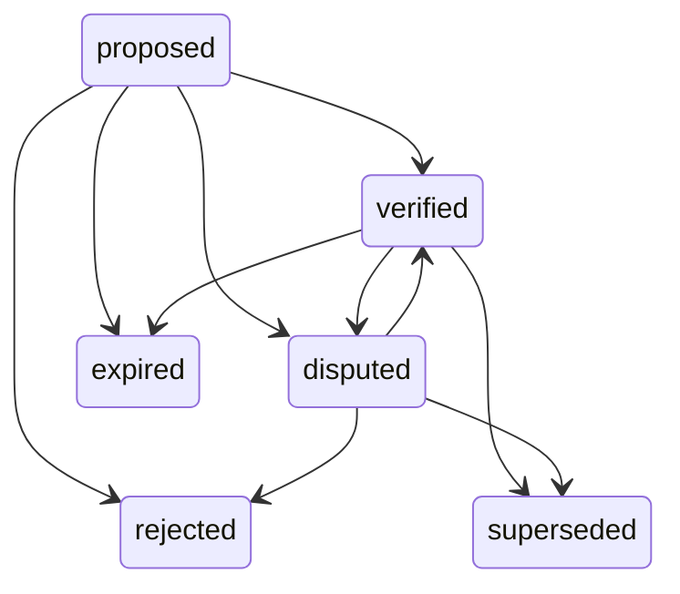

# Hermes Business Fact Lifecycle v1

Status: Slice 3 review candidate.

## Lifecycle States

| state | meaning |
| --- | --- |
| `proposed` | candidate fact exists but is not yet verified |
| `verified` | reviewer or trusted service accepted the fact |
| `disputed` | conflicting evidence or reviewer challenge exists |
| `superseded` | a newer fact replaces this one |
| `expired` | fact is outside its effective window |
| `rejected` | reviewer rejected the fact as unsuitable authority |

## Allowed Transitions

Terminal states are `superseded`, `expired`, and `rejected`.

## Enforcement

The database enforces review shape:

- `verified` facts require `verified_by`;
- `rejected` facts require `rejection_reason`;
- `expired` facts require `effective_to`.

The public transition RPC is
`public.ovos_bk_transition_fact_lifecycle(...)`. It requires an authorised
tenant actor with a governance role, writes bounded audit metadata, and returns
`execution_status=not_executed`.

## Conflict Handling

Dry-run imports detect:

- duplicates by normalized entity key or normalized fact statement;
- conflicts where a candidate fact shares a fact type with an active fact but
  carries a different statement.

Conflict detection does not mutate authoritative facts. It creates import
candidate review records only.
