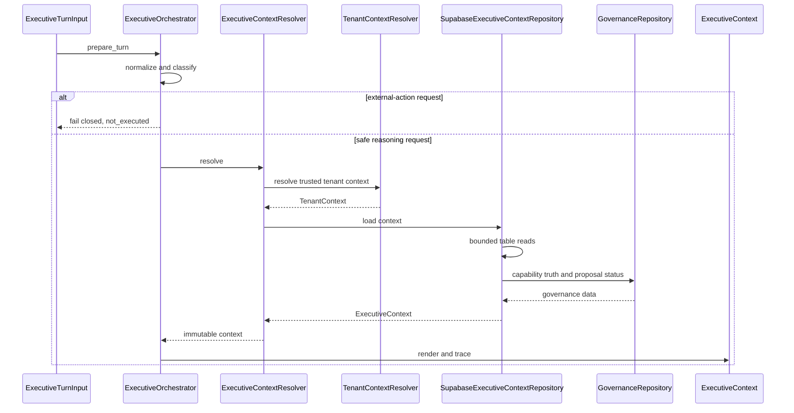

# Hermes Context Resolution Flow

Status: Slice 2 implementation note

## Flow

Every orchestrated reasoning request now begins with context resolution:

```text
Incoming request
Identity resolution
Tenant resolution
Executive Context Repository
Immutable Executive Context
Executive Intelligence
Executive Reasoning
Executive Planning
Reasoning provider
Response observation
```

The previous runtime enrichment path that assembled context from conversation
history, profile flags, mock providers, or local stores is no longer part of the
active reasoning path.

## Resolver Responsibilities

`ExecutiveContextResolver` performs:

1. actor and tenant resolution from trusted runtime configuration;
2. fallback to already-authenticated gateway turn identity when configuration is
   unavailable;
3. repository loading under tenant scope;
4. duplicate removal and deterministic limits;
5. immutable `ExecutiveContext` construction;
6. degraded safe context when the repository is unavailable.

It does not select connectors, invoke adapters, send messages, create tasks, or
perform external writes.

## Sequence Diagram



## Data Sources

The resolver asks the repository for only EDP/OVOS data:

- `ovos.executive_identities`
- `ovos.organisation_contexts`
- `ovos.team_members`
- `ovos.responsibility_assignments`
- `ovos.ede_executive_plans`
- `ovos.conversation_signals`
- `ovos.ede_plan_risks`
- `ovos.ede_approval_requests`
- `ovos.ede_execution_requests`
- `ovos.executive_event_journal`
- `ovos.edp_capability_overlays`
- `ovos.edp_improvement_proposals`
- `ovos.knowledge_memories`
- `ovos.knowledge_objects`

If a table is not yet present in a deployment, the Supabase repository fails
closed and the resolver returns degraded context. Business Knowledge migration
and Executive State are future slices.

## Runtime Compatibility

The Gateway still owns:

- transport handling
- platform normalisation
- authentication at ingress
- session persistence
- outbound response delivery

`AIAgent` still owns:

- model client selection
- configured provider and model
- conversation execution

Hermes Executive Orchestrator now owns:

- request classification
- tenant-first context resolution
- reasoning context construction
- deterministic intelligence invocation
- EDE reasoning and planning advisory calls
- safety boundaries
- trace metadata
- response observation

## Failure Modes

| Failure | Behavior |
| --- | --- |
| Supabase configuration missing | degraded context, warning recorded |
| Repository query unavailable | degraded context, warning recorded |
| Malformed context row | repository error and degraded context |
| Context exceeds limits | deterministic truncation |
| Potential execution request | blocked before model |
| Intelligence failure | warning only; reasoning may continue for safe requests |
| Reasoning/planning advisory failure | warning only; no execution |

The execution state remains `not_executed` in every branch.
