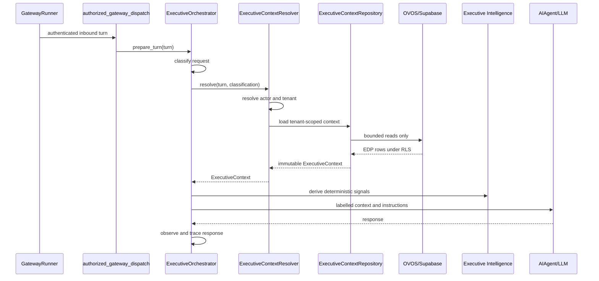

# Hermes Executive Context Repository

Status: Slice 2 implementation note

## Purpose

The Executive Context Repository is the single runtime boundary for assembling
reasoning context before Hermes calls the existing reasoning provider. It
centralises database access, resolves tenant-scoped OVOS/EDP records, and
returns an immutable `ExecutiveContext` object ready for prompt construction,
Executive Intelligence, Executive Reasoning, and Executive Planning.

The repository does not invoke connectors, adapters, subprocesses, shell
commands, webhooks, or live execution interfaces. It reads authoritative
OVOS/Supabase data and preserves the execution boundary as `not_executed`.

## Runtime Location

Implementation:

- `gateway/executive_context_repository.py`
- integrated in `gateway/executive_orchestrator.py`
- diagnostic trace forwarding in `hermes_cli/executive_orchestrator.py`

Runtime insertion point:

```text
GatewayRunner._handle_message
authorized_gateway_dispatch
run_reasoning_with_optional_orchestrator(...)
ExecutiveOrchestrator.prepare_turn(...)
ExecutiveContextResolver.resolve(...)
ExecutiveContextRepository.load(...)
Executive Intelligence
Executive Reasoning
Executive Planning
AIAgent.run_conversation(...)
ExecutiveOrchestrator.observe_response(...)
```

Gateway transport, authentication, platform delivery, session persistence, and
the model client remain outside the repository.

## Repository Contract

`ExecutiveContextRepository.load(...)` accepts:

- authenticated `TenantContext`
- actor id
- request classification
- correlation id
- context limits
- optional environment label

It returns only data:

- no database handles
- no lazy loaders
- no adapter references
- no executable objects
- no local YAML or filesystem context

The Supabase implementation queries bounded OVOS tables via PostgREST using the
configured Supabase credentials. The in-memory implementation is a focused test
double for unit tests only.

## Source Tables

Initial EDP-backed sources:

| Context Area | OVOS/EDP Tables |
| --- | --- |
| Identity | `ovos.executive_identities` plus resolved `TenantContext` |
| Organisation | `ovos.organisation_contexts`, `ovos.team_members`, `ovos.responsibility_assignments` |
| Strategic | `ovos.ede_executive_plans` |
| Operational | `ovos.conversation_signals`, `ovos.ede_plan_risks`, `ovos.ede_approval_requests`, `ovos.ede_execution_requests`, `ovos.executive_event_journal` |
| Governance | `ovos.edp_capability_overlays`, `ovos.edp_improvement_proposals` through governance RPC/repository contracts |
| Knowledge | `ovos.business_entities`, `ovos.business_facts`, `ovos.business_evidence` through Business Knowledge RPCs; legacy `ovos.knowledge_memories`, `ovos.knowledge_objects` where already available |

Vector search, Executive State, ingestion pipelines, and document chunking
remain future slices. Business Knowledge is relational-first and consumed
through the repository boundary, not through direct table access by reasoning.

## Failure Behavior

The repository fails closed:

- missing Supabase configuration yields a degraded context instead of a false
  success;
- repository query failures are surfaced as `ExecutiveContextRepositoryError`;
- resolver fallback records `executive_context_repository_unavailable`;
- safety-sensitive external-action requests are blocked before model reasoning;
- degraded context always states `execution remains not_executed`.

Safe ordinary conversation may continue with degraded context. Potentially
executable requests do not reach the model path.

## Security

Security properties:

- tenant context is resolved before repository loading;
- table queries include tenant filters;
- owner/user filters are applied where source tables model per-user ownership;
- RLS is inherited from Supabase credentials and table policies;
- service-role access is refused unless explicitly enabled for bounded operator
  diagnostics through `HERMES_EDP_ALLOW_SERVICE_ROLE_RPC=true`;
- traces contain digests, source categories, source refs, counts, and warnings,
  not raw private conversation history or secrets.

## Sequence



## Non-Execution Guarantee

Slice 2 introduces no connector and no execution capability. Capability Truth is
included as context, but code-level safety ceilings still mark external
execution and write operations unavailable. Improvement Proposal status is read
as governance context only; proposals are not applied by the repository.
