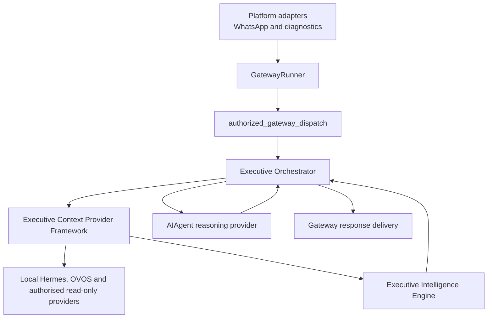

# Hermes Layered Architecture v1

Last updated: 2026-07-29

This document is the durable architecture record for the Hermes Phase 4 target
shape. It describes the current deployed runtime direction and the boundaries
that future milestones must preserve.

## Layer Model

## Responsibilities

Platform adapters own transport-specific receive and delivery mechanics.

`GatewayRunner` owns authentication, platform normalization, session handling,
agent lifecycle, and outbound response delivery.

`authorized_gateway_dispatch` owns existing deterministic gateway and OVOS hook
coexistence before the model path.

The Executive Orchestrator owns request classification, bounded executive
context assembly, reasoning request construction, safety-state text,
post-response observation, event trace metadata, and non-execution enforcement.

The Executive Context Provider Framework owns deterministic provider
registration, contribution validation, scope checks, evidence references,
context budgets, provider health metadata, timeout/error isolation, and safe
trace snapshots.

The Google Calendar Context Provider is the first authorised external-read
provider. It is selected only for Calendar-shaped requests or agenda/briefing
needs, normalises Google events into Hermes-owned contributions, and never
exposes OAuth tokens, attendee email addresses, event descriptions, raw Google
payloads or write APIs to the reasoning provider.

The Executive Intelligence Engine owns deterministic derivation of facts,
signals and transparent scores from canonical context snapshots. It cannot call
integrations, MCP, credentials, LLMs or execution interfaces.

The reasoning provider remains the configured LLM implementation. It reasons
over context selected by Hermes; it does not decide which organisational
context to retrieve.

## Runtime Insertion Point

The narrow insertion point is:

- `/Users/nitinteckchandani/Projects/Hermes-Build/hermes-agent/gateway/run.py`
- class/function: `GatewayRunner._run_agent_inner`
- location: after `authorized_gateway_dispatch`, immediately before the
  previous `agent.run_conversation(...)` call.

The gateway path is intentionally not redesigned.

## Current Production Message Path

1. Platform adapter receives an inbound message.
2. `GatewayRunner._handle_message` handles transport and session setup.
3. `authorized_gateway_dispatch` runs deterministic hooks where applicable.
4. `GatewayRunner._run_agent_inner` builds an `ExecutiveTurnInput`.
5. `run_reasoning_with_optional_orchestrator(...)` prepares the turn when
   `HERMES_EXECUTIVE_ORCHESTRATOR_ENABLED=true`.
6. `ExecutiveContextCollectionService` gathers bounded local context.
7. `ExecutiveIntelligenceEngine` derives request-scoped signals when enabled.
8. `ExecutiveOrchestrator.prepare_turn(...)` constructs the reasoning request.
9. `AIAgent.run_conversation(...)` calls the configured provider/model.
10. `ExecutiveOrchestrator.observe_response(...)` records safe trace metadata.
11. The existing gateway delivery path returns the response.

## Execution Boundary

Execution boundary: `not_executed`

Live execution: disabled

Direct requests to send email, create calendar events, create tasks, modify
records, invoke webhooks, run shell commands, or dispatch adapters fail closed.
The Orchestrator may create or describe declarative plans and proposals only.

## MCP Boundary

MCP is represented only by a disabled read-only boundary contract. No MCP
server is connected, no connector is authorised, and no resource collection is
possible until a future read-only connector milestone explicitly enables it.

Tool access classification distinguishes read, write, and unknown schemas.
Write or unknown access cannot be used for executive context collection.

## Next Milestone

`Hermes Executive Reasoning Engine v1`

That milestone adds explicit ReasoningPlan and ResponsePlan contracts above
Executive Intelligence. It must not authorise Calendar reads, add external
writes or enable live execution.
